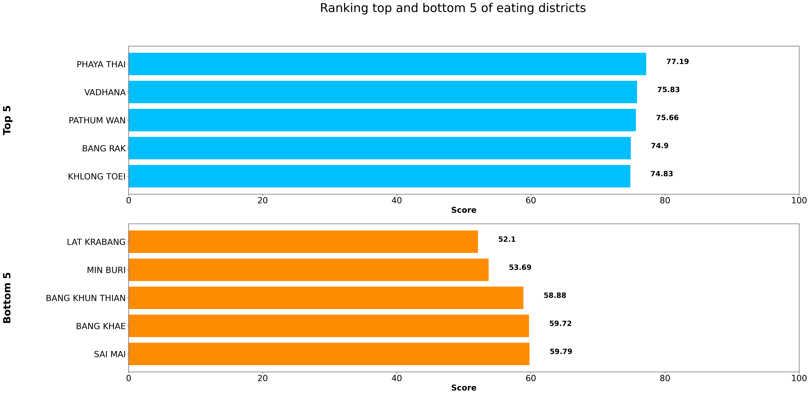

# Mini-project_livable_district
วัตถุประสงค์คือวิเคราะห์ข้อมูลข้อมูลคะแนนอาหารด้านต่างๆทั้งกลางวันและกลางคืน ข้อมูลคะแนนการเดินทางเข้าถึงสถานที่ต่างๆ ข้อมูลค่ากลางราคาในการเช่าอสังหาริมทรัพย์ และข้อมูลการรายงานปัญหาที่เจอในกรุงเทพและปริมณฑล

# ย้ายเข้ากรุงเทพ 101 เขตน่ารู้ในการเลือกเช่าที่พัก
คำถามวิจัย
1.เขตไหนบ้างในกรุงเทพที่น่าอยู่ที่สุดถึงน้อยที่สุดจากคะแนนรวมด้านอาหาร ด้านการเดินทาง ที่มากที่สุด และราคากลาง และจำนวนปัญหาน้อยที่สุด  
2.มีเขตไหนบ้างในกรุงเทพที่น่าอยู่ที่สุดและน้อยที่สุดจากคะแนนรวมด้านอาหาร 
3.มีเขตไหนบ้างในกรุงเทพที่น่าอยู่ที่สุดและน้อยที่สุดจากคะแนนรวมด้านการเดินทาง
4.มีเขตไหนบ้างในกรุงเทพที่ราคาคอนโดต่อตารางเมตรแพงและถูกที่สุด

## Import and check data
นำเข้า library และข้อมูลที่จะใช้ ซึ่งได้แก่ 
1. ข้อมูลคะแนนด้านการบริโภค ซึ่งได้แก่ เขตในกรุงเทพ ช่วงกลางวันและกลางคืนของ คะแนนการรวมการบริโภค คะแนนการการบริโภคด้านราคา คะแนนการการบริโภคด้านคุณภาพการบริการ การการบริโภคด้านคุณภาพการบริการ การการบริโภคด้านความหลากหลายของอาหาร
2. คะแนนด้านการเข้าถึงสถานที่ต่างๆในกรุงเทพ ซึ่งได้แก่ เขตในกรุงเทพ คะแนนการเข้าถึงสถานที่ดำเนินชีวิตประจำวันโดยการเดิน คะแนนการเข้าถึงสถานที่ดำเนินชีวิตประจำวันโดยขนส่งสาธารณะ คะแนนการเข้าถึงสถานที่ดำเนินชีวิตประจำวันโดยการขับรถยนต์
3. ราคาประกาศเช่าที่อยู่อาศัยประเภท จัดสรร ราคาแสดงแบบค่ากลาง (median price) ซึ่งได้แก่ ปี(2021) เดือน ชื่อจังหวัด ชื่อเขต รูปแบบอสังหา ราคาเช่าเฉลี่ย/ตรม
4. ข้อมูลรายงานปัญหาที่เจอในกรุงเทพและปริมณฑลจาก traffy fondue ซึ่งได้แก่ ตั๋วข้อมูล เขตในกรุงเทพ มาหาจำนวนที่เกิดปัญหา


```
import pandas as pd
import requests
from io import StringIO
from google.colab import drive
from google.colab import files
import matplotlib.patches as patches
import matplotlib.pyplot as plt
#drive.mount('/content/drive/MyDrive/dads5001_dataset')
drive.mount('/content/drive')
```
```
#Upload data from the url
eating_url = "https://drive.google.com/file/d/10DgxfeivkUSetxbVqqPGuq0g2PiMNCuj/view?usp=sharing"
path_df1 ='https://drive.google.com/uc?id=' + eating_url.split('/')[-2]
df_eating_score = pd.read_csv(path_df1)

path_df2 = "/content/drive/MyDrive/dads5001_dataset/opendata_living_score.csv"
df_living_score = pd.read_csv(path_df2)

path_df3 = "/content/drive/MyDrive/dads5001_dataset/opendata_median_price_rent.csv"
df_median_price_rent = pd.read_csv(path_df3)

path4 = "/content/drive/MyDrive/dads5001_dataset/teamchadchart.csv" 
df_chadchart = pd.read_csv(path4)
```
### Check data
พบว่าข้อมูลส่วนใหญ่ค่อนข้างสะอาดยกเว้นของ traffy ที่มี null 
```
df_eating_score.info() #check data -> all = non-null
RangeIndex: 554 entries, 0 to 553
Data columns (total 19 columns):
 #   Column                    Non-Null Count  Dtype  
---  ------                    --------------  -----  
 0   row_number                554 non-null    int64  
 1   subdistrict_id            554 non-null    int64  
 2   subdistrict_name_en       554 non-null    object 
 3   subdistrict_name_th       554 non-null    object 
 4   district_id               554 non-null    int64  
 5   district_name_en          554 non-null    object 
 6   district_name_th          554 non-null    object 
 7   province_id               554 non-null    int64  
 8   province_name_en          554 non-null    object 
 9   province_name_th          554 non-null    object 
 10  eating_daytime            554 non-null    float64
 11  eating_daytime_price      554 non-null    float64
 12  eating_daytime_quality    554 non-null    float64
 13  eating_daytime_variety    554 non-null    float64
 14  eating_nighttime          554 non-null    float64
 15  eating_nighttime_price    554 non-null    float64
 16  eating_nighttime_quality  554 non-null    float64
 17  eating_nighttime_variety  554 non-null    float64
 18  source                    554 non-null    object 
dtypes: float64(8), int64(4), object(7)

df_living_score.info() #check data -> all = non-null
RangeIndex: 708 entries, 0 to 707
Data columns (total 27 columns):
 #   Column                Non-Null Count  Dtype  
---  ------                --------------  -----  
 0   row_number            708 non-null    int64  
 1   subdistrict_id        708 non-null    int64  
 2   subdistrict_name_en   708 non-null    object 
 3   subdistrict_name_th   708 non-null    object 
 4   district_id           708 non-null    int64  
 5   district_name_en      708 non-null    object 
 6   district_name_th      708 non-null    object 
 7   province_id           708 non-null    int64  
 8   province_name_en      708 non-null    object 
 9   province_name_th      708 non-null    object 
 10  walk_leisure          708 non-null    float64
 11  walk_public_service   708 non-null    float64
 12  walk_school           708 non-null    float64
 13  walk_shopping         708 non-null    float64
 14  walk_work             708 non-null    float64
 15  walk_total            708 non-null    float64
 16  access_boat           708 non-null    float64
 17  access_bus            708 non-null    float64
 18  access_train          708 non-null    float64
 19  access_total          708 non-null    float64
 20  drive_leisure         708 non-null    float64
 21  drive_public_service  708 non-null    float64
 22  drive_school          708 non-null    float64
 23  drive_shopping        708 non-null    float64
 24  drive_work            708 non-null    float64
 25  drive_total           708 non-null    float64
 26  source                708 non-null    object 

df_median_price_rent.info() #check data -> all = non-null
RangeIndex: 1550 entries, 0 to 1549
Data columns (total 11 columns):
 #   Column                        Non-Null Count  Dtype 
---  ------                        --------------  ----- 
 0   row_number                    1550 non-null   int64 
 1   transction_year               1550 non-null   int64 
 2   transction_month              1550 non-null   int64 
 3   listing_province_name_th      1550 non-null   object
 4   listing_province_name_en      1550 non-null   object
 5   listing_district_name_th      1550 non-null   object
 6   listing_district_name_en      1550 non-null   object
 7   project_propertytype_name_th  1550 non-null   object
 8   project_propertytype_name_en  1550 non-null   object
 9   total_listing                 1550 non-null   int64 
 10  median_rent_price_sqm         1550 non-null   int64 
dtypes: int64(5), object(6)

df_chadchart.info() #check data -> has null
RangeIndex: 122163 entries, 0 to 122162
Data columns (total 12 columns):
 #   Column        Non-Null Count   Dtype 
---  ------        --------------   ----- 
 0   ticket_id     122109 non-null  object
 1   type          68412 non-null   object
 2   organization  122109 non-null  object
 3   comment       121957 non-null  object
 4   coords        122163 non-null  object
 5   photo         122163 non-null  object
 6   address       122109 non-null  object
 7   district      121519 non-null  object
 8   subdistrict   121521 non-null  object
 9   province      122101 non-null  object
 10  timestamp     122163 non-null  object
 11  state         122132 non-null  object
dtypes: object(12)
```


## Filter and clean data
### Filter
ทำการเลือกข้อมูลที่ต้องการจะใช้จากข้อมูลด้านบนซึ่งเลือกจากในเขตกรุงเทพเท่านั้น


### Aggreate and merge
คิดค่าเฉลี่ยของของค่ากลางในแต่ละเขต และจำนวนเคสที่ถูกรายงานแยกเป็นรายเขตและรวมข้อมูลไว้ด้วยกัน ซึ่งจากเขตจำนวน 50 เขต เมื่อนำมารวมกับค่าเช่าต่อตารางเมตรปี 2021 จะพบว่ามีเพียง 37 เขตเท่านั้น และนำทุกข้อมูลมาหาค่าเฉลี่ยแบ่งเป็นประเภท เช่น การบริโภค การเดินทาง และนำมาคำนวณรวมกันอีกครั้ง จากนั้นทำการ normalize ข้อมูลแต่ละอัน ได้แก่่ คะแนนรวมของการกินและการเดินทาง และเขตที่จำนวนเคสน้อยที่สุดและถูกที่สุด นำมารวมกันหาค่าเฉลี่ย จะได้ค่าเฉลี่ยคะแนนที่ดีที่สุดจากทั้ง 3 ด้าน 


```

Int64Index: 37 entries, 10 to 12
Data columns (total 18 columns):
 #   Column                                     Non-Null Count  Dtype  
---  ------                                     --------------  -----  
 0   district_name_en                           37 non-null     object 
 1   eating_daytime                             37 non-null     float64
 2   eating_daytime_price                       37 non-null     float64
 3   eating_daytime_quality                     37 non-null     float64
 4   eating_daytime_variety                     37 non-null     float64
 5   eating_nighttime                           37 non-null     float64
 6   eating_nighttime_price                     37 non-null     float64
 7   eating_nighttime_quality                   37 non-null     float64
 8   eating_nighttime_variety                   37 non-null     float64
 9   walk_total                                 37 non-null     float64
 10  access_total                               37 non-null     float64
 11  drive_total                                37 non-null     float64
 12  mean_median_rent_price_sqm_district(2021)  37 non-null     float64
 13  No.case                                    37 non-null     float64
 14  mean_eating                                37 non-null     float64
 15  mean_travel                                37 non-null     float64
 16  mean_all                                   37 non-null     float64
 17  normalized_all                             37 non-null     float64
dtypes: float64(17), object(1)
```


## Visualization
จากข้อมูลสามารถตอบคำถามวิจัยได้ดังนี้
1.Q:มีเขตไหนบ้างในกรุงเทพที่น่าอยู่ที่สุดถึงน้อยที่สุดจากคะแนนรวมด้านอาหาร ด้านการเดินทาง ที่มากที่สุด และราคากลาง และจำนวนปัญหาน้อยที่สุด  A: ข้อมูลที่มีอันดับสูงที่สุด 5 อันดับแรกได้แก่ บางกอกใหญ่(83.46%) ธนบุรี(81.98%) บางคอแหลม(79.86%) คลองสาน(78.31%) และวังทองหลาง(77.04%) ส่วนอันดับต่ำที่สุด 5 อันดับหลังได้แก่ จตุจักร(40.66%) บางขุนเทียน(51.26%) ลาดกระบัง(52.76%) บางแค(54.34%) และบางเขน(56.16%) 


### All district ranking


### Top and bottom 5 livable districts 


### Top and bottom 5 eating districts 
2.Q: มีเขตไหนบ้างในกรุงเทพที่น่าอยู่ที่สุดและน้อยที่สุดจากคะแนนรวมด้านอาหาร A: 5 อันดับแรกได้แก่ พญาไท(77.19%) วัฒนา(75.83%) ปทุมวัน(75.66%) บางรัก(74.9%) และคลองเตย(74.83%) ส่วนอันดับต่ำที่สุด 5 อันดับหลังได้แก่ จตุจักร(52.10%) บางขุนเทียน(53.60%) ลาดกระบัง(58.88%) บางแค(59.72%) และบางเขน(59.79%) 



### Top and bottom 5 travel districts 
3.	Q: มีเขตไหนบ้างในกรุงเทพที่น่าอยู่ที่สุดและน้อยที่สุดจากคะแนนรวมด้านการเดินทาง A: 5 อันดับแรกได้แก่ บางรัก(99%) ราชเทวี(98.92%)  ปทุมวัน(98.83%)  คลองสาน(98.58%) และธนบุรี(98.50%) ส่วนอันดับต่ำที่สุด 5 อันดับหลังได้แก่ บางขุนเทียน(62.50%) สายไหม(67.55%) ลาดกระบัง(69.17%) มีนบุรี(69.33%) บางแค(69.50%)


### Top and bottom 5 price of the districts 
4.	Q: มีเขตไหนบ้างในกรุงเทพที่ราคาคอนโดต่อตารางเมตรแพงและถูกที่สุด  A: 5 อันดับที่แพงที่สุดได้แก่ ปทุมวัน(737.67) บางรัก(647.42) วัฒนา(635.67) คลองเตย(632.5) และสาธร(586) และ 5 อันดับที่ถูกที่สุด ได้แก่ มีนบุรี(228) ประเวศ(242.67) ลาดกระบัง(244) บึงกุ่ม(250.5) และบางแค(275.67)


## Challenge
1.	ปัญหาการ import data: เชื่อม path ข้อมูลไม่ได้ -> ต้อง mount drive แทน, อ่านข้อมูลแล้วกลายเป็น !DOCTYPE
2.	ปัญหา feature engineering : ประเภทข้อมูลใน dataset 2 ตารางไม่เท่ากัน เช่นเขตมี 50 เขต แต่ data ข้อมูลต่อตารางเมตรในปี 2021 มีเพียง 37 เขต -> ต้องใช้เท่าที่มี, การจัดอับดับจากหลายตัวแปร ในตอนแรกว่าจะจัดลำดับด้วย sort_values แต่จะมีก่อนหลังเลยจำเป็นต้องทำ mean data และ normalize ให้ data มีค่าใกล้กัน
3.	ปัญหา visualization: ข้อมูลจัดอันดับข้ามแถว -> เลือกแถวไม่ได้เลยใช้ iloc แทน, ข้อความทับกัน -> ต้องปรับข้อความขึ้นในแกน y, รูปทรงไม่พอดี -> ปรับขนาดและปรับแกน, ค่าสูงสุดของแกน x ของข้อมูลไม่เท่ากัน -> ตั้งค่าแกน x ให้แบ่งเป็นช่วงเท่าๆกัน


## Data glossary

### Eating score

subdistrict_id =	รหัสตำบล	int4(32,0)  
subdistrict_name_en =	ชื่อตำบล ภาษาอังกฤษ	text  
subdistrict_name_th	= ชื่อตำบล ภาษาไทย	text  
district_id	= รหัสอำเภอ	int4(32,0)  
district_name_en	= ชื่ออำเภอ ภาษาอังกฤษ	text  
district_name_th	= ชื่ออำเภอ ภาษาไทย	text  
province_id	= รหัสจังหวัด	int4(32,0)  
province_name_en	= ชื่อจังหวัด ภาษาอังกฤษ	text  
province_name_th	= ชื่อจังหวัด ภาษาไทย	text  
eating_daytime	= คะแนนการกิน ด้านราคา ช่วงกลางวัน	float8(53,0)  
eating_daytime_price	= คะแนนการกิน ด้านคุณภาพการบริการ ช่วงกลางวัน	float8(53,0)  
eating_daytime_quality	= คะแนนการกิน ด้านความหลากหลายของอาหาร ช่วงกลางวัน	float8(53,0)  
eating_daytime_variety	= คะแนนการกิน ด้านความหลากหลายของอาหาร ช่วงกลางวัน	float8(53,0)  
eating_nighttime	= คะแนนการกิน ด้านราคา ช่วงกลางคืน	float8(53,0)  
eating_nighttime_price	= คะแนนการกิน ด้านคุณภาพการบริการ ช่วงกลางคืน	float8(53,0)  
eating_nighttime_quality	= คะแนนการกิน ด้านความหลากหลายของอาหาร ช่วงกลางคืน	float8(53,0)  
eating_nighttime_variety	= คะแนนการกิน ด้านความหลากหลายของอาหาร ช่วงกลางคืน	float8(53,0)  
source	= แหล่งที่มาของข้อมูล	text  

### Living score
subdistrict_id	= รหัสตำบล	int4(32,0)  
subdistrict_name_en	= ชื่อตำบล ภาษาอังกฤษ	text  
subdistrict_name_th	= ชื่อตำบล ภาษาไทย	text  
district_id	= รหัสอำเภอ	int4(32,0)  
district_name_en	 = ชื่ออำเภอ ภาษาอังกฤษ	text  
district_name_th	= ชื่ออำเภอ ภาษาไทย	text  
province_id	 = รหัสจังหวัด	int4(32,0)  
province_name_en	= ชื่อจังหวัด ภาษาอังกฤษ	text  
province_name_th =	ชื่อจังหวัด ภาษาไทย	text  
walk_leisure =	คะแนนการเข้าถึงสถานที่พักผ่อนหย่อนใจ โดยการเดิน	float8(53,0)  
walk_public_service =	คะแนนการเข้าถึงสถานที่บริการสาธารณะ โดยการเดิน	float8(53,0)  
walk_school	= คะแนนการเข้าถึงสถานศึกษา โดยการเดิน	float8(53,0)  
walk_shopping	= คะแนนการเข้าถึงสถานที่ shopping โดยการเดิน	float8(53,0)  
walk_work	= คะแนนการเข้าถึงแหล่งทำงาน โดยการเดิน	float8(53,0)  
walk_total	= คะแนนการเข้าถึงสถานที่ดำเนินชีวิตประจำวัน โดยการเดิน	float8(53,0)  
access_boat	= คะแนนการเข้าถึงสถานที่ดำเนินชีวิตประจำวัน โดยขนส่งเรือสาธารณะ	float8(53,0)  
access_bus	= คะแนนการเข้าถึงสถานที่ดำเนินชีวิตประจำวัน โดยขนส่งรถ Bus สาธารณะ	float8(53,0)  
access_train	= คะแนนการเข้าถึงสถานที่ดำเนินชีวิตประจำวัน โดยขนส่งรถไฟสาธารณะ	float8(53,0)  
access_total	= คะแนนการเข้าถึงสถานที่ดำเนินชีวิตประจำวัน โดยขนส่งสาธารณะ	float8(53,0)  
drive_leisure	คะแนนการเข้าถึงสถานที่พักผ่อนหย่อนใจ โดยการขับรถยนต์	float8(53,0)  
drive_public_service	= คะแนนการเข้าถึงสถานที่บริการสาธารณะ โดยการขับรถยนต์	float8(53,0)  
drive_school	= คะแนนการเข้าถึงสถานศึกษา โดยการขับรถยนต์	float8(53,0)  
drive_shopping	= คะแนนการเข้าถึงสถานที่ shopping โดยการขับรถยนต์	float8(53,0)  
drive_work	= คะแนนการเข้าถึงแหล่งทำงาน โดยการขับรถยนต์	float8(53,0)  
drive_total	= คะแนนการเข้าถึงสถานที่ดำเนินชีวิตประจำวัน โดยการขับรถยนต์	float8(53,0)  
source	= แหล่งที่มาของข้อมูล  

### Median rent price
transction_year	= ปี	Date (Year)  
transction_month	= เดือน	Date (Month)  
listing_province_name_th	= ชื่อจังหวัด ภาษาไทย	text  
listing_province_name_en	= ชื่อจังหวัด ภาษาอังกฤษ	text  
listing_district_name_th	= ชื่อเขต ภาษาไทย	text  
listing_district_name_en	= ชื่อเขต ภาษาอังกฤษ	text  
project_propertytype_name_th	= รูปแบบ อสังหา ภาษาไทย	text  
project_propertytype_name_en	= รูปแบบ อสังหา ภาษาอังกฤษ	text  
Total_Listing	= จำนวน โครงการทั้งหมด	int4(32,0)  
median_rent_price_sqm	= ราคาเช่าเฉลี่ย/ตรม	int4(32,0)  

### chadchart

 ticket_id  = หมายเลขตั๋ว   object  
 type = ประเภทปัญหาเส้นเลือดฝอย object  
 organization = องค์กร object  
 comment = ความเห็น object  
 coords = ละติจูด ลองจิจูด object  
 photo =  รูปภาพ object  
 address = ที่อยู่ object  
 district = เขต object  
 subdistrict = แขวง   object  
 province = จังหวัด object  
 timestamp = เวลาที่ส่งเรื่อง object  
 state = สถานะ object  

## Reference
1.ข้อมูลคะแนนด้านการบริโภค คะแนนด้านการเข้าถึงสถานที่ต่างๆในกรุงเทพ ราคาประกาศเช่าที่อยู่อาศัยประเภท จัดสรร ราคาแสดงแบบค่ากลาง (median price)  
https://gobestimate.com/data?fbclid=IwAR1O4o-h8h-Mz3wZoCAEZJCQj_8DLEM2jAlLhAHHHlcscdMzh4oql21DcL0  

2. ข้อมูลรายงานปัญหาที่เจอในกรุงเทพและปริมณฑลจาก traffy fondue  
https://www.traffy.in.th/?page_id=4434


